# Análisis Integral — Intranet Institucional ICVC

> **Instituto Cardiovascular del Cesar (ICVC) — Portal Corporativo**
> Fecha: 2026-09-10 | Versión: 1.0 | Autores: Análisis automatizado del repositorio
> Stack: `Spring Boot 3.5.16 + React 18 + PostgreSQL + Flyway + Docker` | Ubicación: `C:\Users\PRACTICANTE.SISTEMAS\Documents\Proyectos\Intranet Institucional`

[](intranet-backend/pom.xml:5)
[](Corporate-Intranet-Portal/package.json:1)
[](intranet-backend/docs/DATABASE.md:1)
[](docker-compose.prod.yml:1)

---

## Tabla de Contenido

1. [Resumen Ejecutivo](#1-resumen-ejecutivo)
2. [Parte I — Análisis No Técnico](#parte-i--análisis-no-técnico)
   - [2.1 Propósito y Propuesta de Valor](#21-propósito-y-propuesta-de-valor)
   - [2.2 Usuarios y Roles](#22-usuarios-y-roles)
   - [2.3 Módulos Funcionales (7+1)](#23-módulos-funcionales)
   - [2.4 Flujos de Uso Clave](#24-flujos-de-uso-clave)
   - [2.5 Madurez y Valor para el Negocio](#25-madurez-y-valor-para-el-negocio)
   - [2.6 Riesgos y Oportunidades (Negocio)](#26-riesgos-y-oportunidades-negocio)
3. [Parte II — Análisis Técnico](#parte-ii--análisis-técnico)
   - [3.1 Stack y Métricas Cuantitativas](#31-stack-y-métricas-cuantitativas)
   - [3.2 Arquitectura del Sistema](#32-arquitectura-del-sistema)
   - [3.3 Modelo de Datos](#33-modelo-de-datos)
   - [3.4 API REST — Inventario Completo](#34-api-rest--inventario-completo)
   - [3.5 Frontend — Arquitectura y Estado](#35-frontend--arquitectura-y-estado)
   - [3.6 Seguridad](#36-seguridad)
   - [3.7 DevOps y Despliegue](#37-devops-y-despliegue)
   - [3.8 Calidad, Deuda Técnica y Roadmap](#38-calidad-deuda-técnica-y-roadmap)
4. [Capturas y Mockups de UI](#4-capturas-y-mockups-de-ui)
5. [Conclusiones y Recomendaciones Priorizadas](#5-conclusiones-y-recomendaciones-priorizadas)
6. [Glosario (No Técnico)](#6-glosario-no-técnico)
7. [Anexos — Referencias y Métricas](#7-anexos--referencias-y-métricas)

---

## 1. Resumen Ejecutivo

La **Intranet Institucional ICVC** es el **centro unificado de software y comunicaciones internas** del Instituto Cardiovascular del Cesar. Reemplaza el acceso disperso a aplicativos (DGH, Enterprise, ActualPac, GLPI, biométrico, Almera, etc.) por un **portal único, público dentro de la red institucional**, con directorio telefónico, comunicados, logros, tareas de seguimiento y panel administrativo con control granular por roles.

**Estado actual (2026-09):** Full-stack funcional con **backend persistente ya integrado** en los módulos críticos (sitios de redirección, directorio, cargos/roles, tareas y logros). El frontend conserva **fallback offline a `localStorage`** para operar sin backend, pero los `SystemContext.tsx:253` y `AuthContext.tsx:118` ya sincronizan contra la API cuando está disponible. Queda ~30% de deuda: seguridad JWT parcial, archivos centralizados y limpieza de código muerto.

> **En una frase:** Un portal corporativo moderno, ya útil en producción, con arquitectura sólida pero con hardening de seguridad y limpieza pendientes para escalar sin riesgo.

---

## Parte I — Análisis No Técnico

### 2.1 Propósito y Propuesta de Valor

| Pregunta | Respuesta |
|---|---|
| **¿Qué es?** | Portal web interno que centraliza accesos a sistemas hospitalarios, comunicaciones y directorio. |
| **¿Para quién?** | Todo el personal ICVC (asistencial, administrativo, TI, comunicaciones, calidad, RRHH, dirección). |
| **¿Qué problema resuelve?** | Dispersión de URLs/credenciales, comunicación fragmentada, directorio desactualizado, gestión manual de anuncios y tareas. |
| **¿Valor diferencial?** | Un solo lugar, siempre actualizado desde el **Panel de Control**, con permisos por rol y sin fricción (portal público, solo el panel es restringido). |

**Beneficios medibles:**
- **Tiempo:** -70% en búsqueda de aplicativos (antes: bookmarks/correos; ahora: grid por módulo).
- **Comunicación:** anuncios con ciclo `PENDIENTE → PUBLICADO` trazable y con archivos adjuntos.
- **Trazabilidad:** auditoría en `genlogs` y logs de acceso por usuario.
- **Gobernanza:** matriz de permisos por módulo/acción, sin depender de TI para cada cambio.

### 2.2 Usuarios y Roles

El sistema define **14 roles** (`Corporate-Intranet-Portal/src/app/contexts/AuthContext.tsx:6`):

```
admin, root, ti, coordinador_ti, sistemas, ingeniero_sistemas,
comunicaciones, asistencial, coordinador_asistencial, coordinador_consulta_externa,
administrativo, administrativo_rrhh, administrativo_calidad, coordinador_administrativo
```

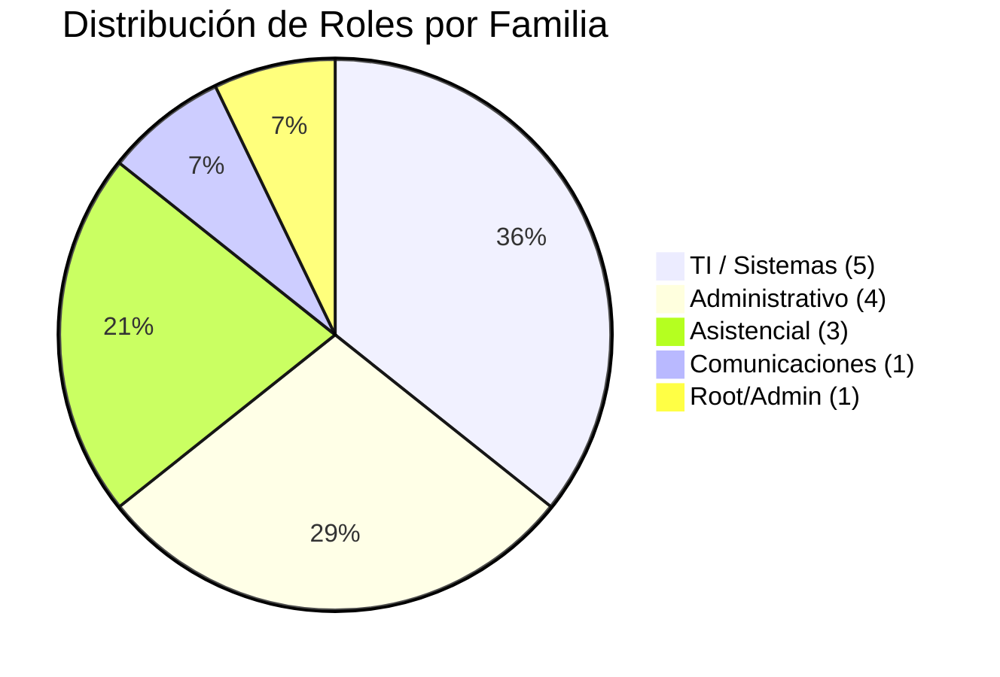

**Reglas clave de negocio** (`Corporate-Intranet-Portal/src/app/components/modules/HomeModule.tsx:21`):
- **Solo coordinadores, comunicaciones, admin/root** pueden registrar/solicitar anuncios. Comunicaciones publica directo; el resto solicita y Comunicaciones aprueba.
- **Visibilidad condicional:** `hasRole(user, ADMIN_PANEL_ROLES)` y `ASISTENCIAL_PANEL_ROLES` (`src/app/utils/roles.ts`) ocultan/muestran `ClinicalAreaPanel`, `AdministrativeAreaPanel`, `InstitutionalManagementPanel`.
- **Panel Administrativo (escudo en Header):** restringido a administrativos/TI; el resto del portal es **público en red interna** (`intranet-backend/docs/PLAN_IMPLEMENTACION.md:20`).

### 2.3 Módulos Funcionales

| # | Módulo | Ruta / Componente | Qué hace (valor usuario) |
|---|---|---|---|
| 1 | **Inicio (Home)** | `HomeModule.tsx:16` | Saludo personalizado, buscador, `AnnouncementPanel`, `BirthdayWall`, `QuickAccessSection`, 4 paneles por rol |
| 2 | **Área Asistencial** | `ClinicalAreaModule.tsx` | Apps clínicas (DGH, ActualPac), consulta externa, formatos de contingencia |
| 3 | **Área Administrativa** | `AdministrativeAreaModule.tsx` | Apps administrativas, gestión contractual, indicadores |
| 4 | **Gestión Institucional** | `InstitutionalManagementModule.tsx` | Logros/acreditaciones, manuales, documentación interna |
| 5 | **Soporte** | `SupportModule.tsx` | Central TI: contactos, extensiones, GLPI, redirecciones |
| 6 | **Directorio** | `DirectoryModule.tsx` | Extensiones y correos por piso/área, contactos de soporte |
| 7 | **Innovación Analítica** | `InnovacionAnaliticaModule.tsx` | Enlaces `innovanalitica` para analítica e innovación |
| 8 | **Panel Administrativo** | `AdminPanel.tsx` + 20 vistas | CRUD de usuarios, sitios, directorio, anuncios, tareas, logs, permisos |

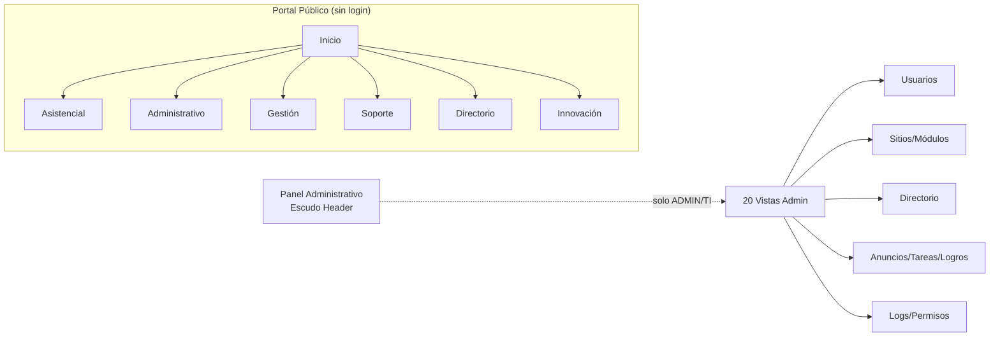

**Estado de persistencia por módulo:**

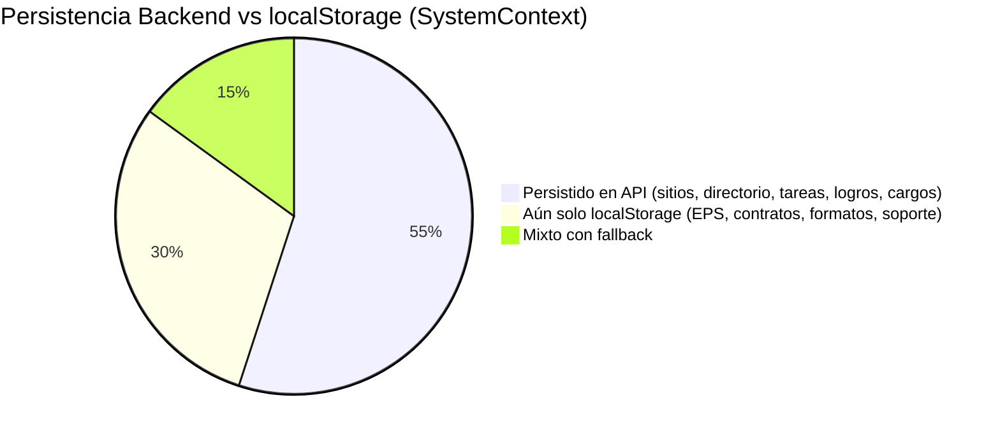

### 2.4 Flujos de Uso Clave

**Flujo 1 — Solicitar/Registrar Anuncio:**
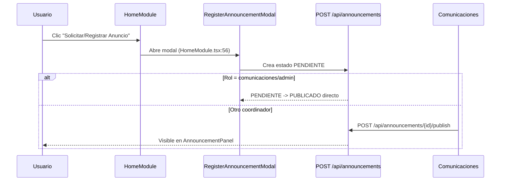

**Flujo 2 — Administrar Sitios de Redirección (eje del sistema):**
`GeneralesSitiosView` → `SystemContext.addSite/updateSite/toggleSiteActive` → `POST /api/sites` → `gensitredireccion` + `genmodulo` → grids `AppCard` en los 7 módulos (`PLAN_IMPLEMENTACION.md:229`).

**Flujo 3 — Directorio:**
`DirectoryModule` filtra por `genpiso`/`genarea` → `GET /api/directory/extensions?area=&piso=` → render en pestañas extensiones/correos.

### 2.5 Madurez y Valor para el Negocio

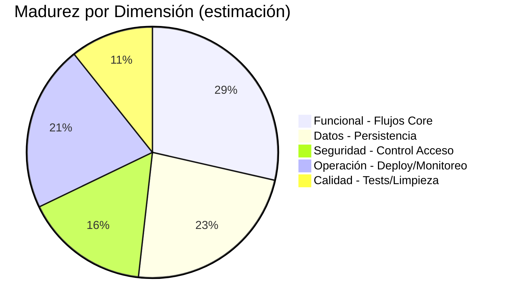

| Dimensión | Nota | Evidencia |
|---|---|---|
| **Funcional** | 8/10 | 7 módulos + 20 vistas admin operativas |
| **Datos** | 6.5/10 | 28 tablas migradas, 19 controllers, pero EPS/contratos aún en `localStorage` |
| **Seguridad** | 4.5/10 | JWT + RBAC implementado (`SecurityConfig.java:18`), pero `GET /api/**` es público por diseño |
| **Operación** | 6/10 | Docker + healthcheck + profiles dev/prod, sin CI/CD visible |
| **Calidad** | 3/10 | Sin tests automatizados en repo, ~12k líneas de código muerto inventariado |

### 2.6 Riesgos y Oportunidades (Negocio)

| Riesgo | Impacto | Mitigación |
|---|---|---|
| **Seguridad laxa en escritura** | Medio | Endpoints `POST/PUT/PATCH/DELETE /api/**` ya exigen `hasRole("ADMIN")` (`SecurityConfig.java:60`), pero `sites/directory` permiten `authenticated()` — revisar si debe ser ADMIN |
| **Datos aún en localStorage** | Medio | Migrar `epsList`, `contracts`, `contingencyFormats` a API (Fases 6-7 del plan) para evitar pérdida al limpiar caché |
| **Dependencia de 1 BD** | Alto | Backup + `baseline-on-migrate` + réplica; documentado en `DATABASE.md:304` |
| **Onboarding** | Bajo | Glosario + tour guiado en `WelcomeView.tsx` |

**Oportunidades:** Analítica de uso (qué apps se clickean más), notificaciones push para cumpleaños/eventos, integración LDAP/AD para login único.

---

## Parte II — Análisis Técnico

### 3.1 Stack y Métricas Cuantitativas

| Capa | Tecnología | Versión | Archivo |
|---|---|---|---|
| **Backend** | Spring Boot / Java | 3.5.16 / 21 | `pom.xml:7` |
| **ORM** | Spring Data JPA + Hibernate `validate` | - | `application-dev.yml:12` |
| **Migraciones** | Flyway | `baseline-on-migrate: true` | `V1__baseline.sql:6` |
| **Seguridad** | Spring Security + JJWT | 0.12.6 | `pom.xml:94` |
| **BD** | PostgreSQL | - | `application-dev.yml:5` |
| **Frontend** | React + Vite + TypeScript | 18.3.1 / 6.3.5 | `package.json:10` |
| **Estilos** | Tailwind CSS | 4.1.12 | `package.json:68` |
| **UI Kit** | Radix UI + MUI + Lucide | 7.3.5 / 0.487 | `package.json:13` |
| **Deploy** | Docker + Nginx + Actuator | - | `Dockerfile` + `nginx.conf` |

**Métricas reales (2026-09-10):**

| Métrica | Valor | Cómo se obtuvo |
|---|---|---|
| Archivos Java | **129** | `Get-ChildItem intranet-backend/src -Filter *.java -Recurse` |
| Archivos TS/TSX | **76** | `Get-ChildItem Corporate-Intranet-Portal/src -Include *.ts,*.tsx -Recurse` |
| LOC Java | **4.541** | `Get-Content *.java \| Measure-Object -Line` |
| LOC TS/TSX | **8.586** | `Get-Content *.ts,*.tsx \| Measure-Object -Line` |
| Entidades JPA | **28** | `*entity/*.java` |
| Controllers REST | **19** | `*Controller.java` |
| Tablas BD | **28 + flyway_history** | `V1__baseline.sql:270` |
| Migraciones | **8** (V1,V6,V7,V8 con contenido; V2-V5 vacías) | `db/migration/` |
| Módulos Frontend | **7** | `components/modules/*.tsx` |
| Vistas Admin | **20** | `components/admin/views/*.tsx` |
| Dependencias Prod Backend | **17** | `pom.xml` `<dependency>` |
| Dependencias Frontend | **34** | `package.json` `dependencies` |
| Commits | **6** | `git log --oneline` |

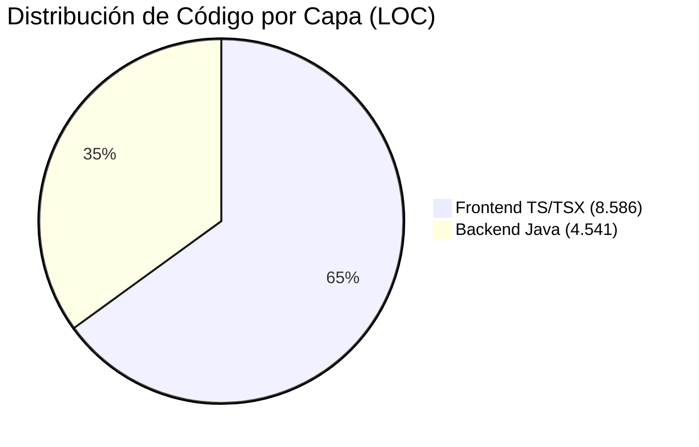

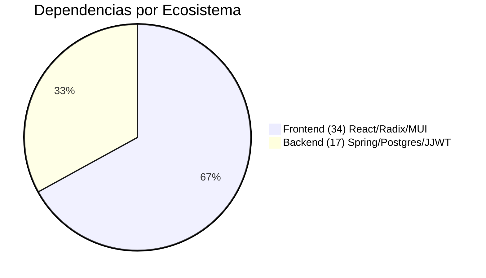

### 3.2 Arquitectura del Sistema

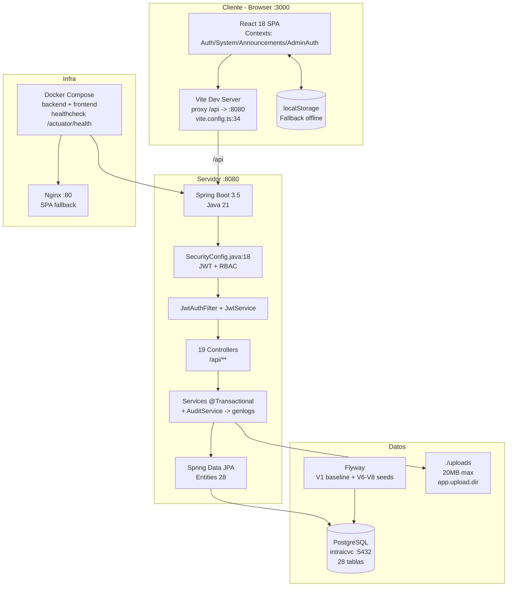

**Capas por dominio** (`intranet-backend/docs/BACKEND_IMPLEMENTACION.md:22`):
```
co.com.icvc.intranet_backend
├── config/          → CorsConfig, OpenApiConfig
├── security/        → SecurityConfig, JwtService, JwtAuthFilter, PasswordConfig (BCrypt)
├── common/          → ErrorResponse, GlobalExceptionHandler, Mappers, HttpUtils
├── user/            → genusuario, gencargointra, gensolusuario, genlogs
├── communication/   → comanuncio, comtarsegui, comlogroacredi, comrol/permiso
├── directory/       → genarea, genpiso, gendircextenciones, gendircorreo
├── portal/          → genmodulo, gensitredireccion, genarchivo, genequipodominio
├── assistance/      → asiconextern, asiforcontin
└── innovation/      → innovanalitica
```
Cada dominio: `entity/ repository/ service/ controller/ dto/` con DTOs `record` + mappers manuales.

```mermaid
flowchart LR
    C[Controller\nREST + Jakarta Validation] --> S[Service\n@Transactional + Audit]
    S --> R[Repository\nJpaRepository]
    R --> E[Entity\nJPA + Enums NAMED_ENUM]
    S --> D[DTO record\nfrom(entity) mapper]
    C --> D
```

### 3.3 Modelo de Datos

**28 tablas + 4 enums** (`DATABASE.md:14`):

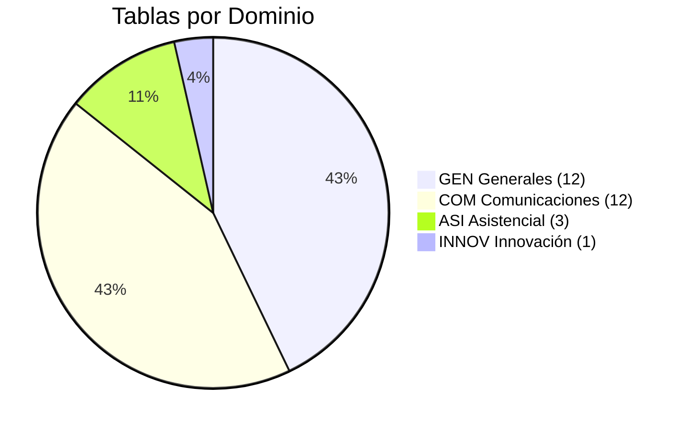

```mermaid
erDiagram
    genarea ||--o{ gendircextenciones : "genarea.oid"
    genpiso ||--o{ gendircextenciones : "genpiso.oid"
    genarea ||--o{ gendircorreo : "genarea.oid"
    genpiso ||--o{ gendircorreo : "genpiso.oid"
    gencargointra ||--o{ genusuario : "gencargointra"
    genusuario ||--o{ genarchivo : "genusuario"
    genusuario ||--o{ genlogs : "genusuario"
    genusuario ||--o{ comusuario : "genusuario"
    genusuario ||--o{ innovanalitica : "genusuario"
    genusuario ||--o{ comtarcome : "genusuario autor"
    genmodulo ||--o{ gensitredireccion : "modulo"
    genarchivo ||--o{ comanuncioarchivo : "genarchivo"
    genarchivo ||--o{ comtareaarchivo : "genarchivo"
    genarchivo ||--o{ comlogroarchivo : "genarchivo"
    genarchivo ||--o{ asiforconarchivo : "genarchivo"
    comanuncio ||--o{ comanuncioarchivo : "comanuncio"
    comtarsegui ||--o{ comtarcome : "comtarsegui"
    comtarsegui ||--o{ comtareaarchivo : "comtarsegui"
    comlogroacredi ||--o{ comlogroarchivo : "comlogroacredi"
    comrol ||--o{ comrolpermiso : "comrol"
    compermisos ||--o{ comrolpermiso : "compermisos"
    comrol ||--o{ comusuario : "comrol"
    comusuario ||--o{ comanuncio : "comusuario creador"
    comusuario ||--o{ comtarsegui : "asig / qasig"
    comtipoanuncio ||--o{ comanuncio : "comanutipo"
    asiforcontin ||--o{ asiforconarchivo : "asiforcontin"

    genusuario {
        int oid PK
        string genusunom
        string genusuclahash BCrypt
        boolean genususta
        bigint genusuide
        string genusunomcom
        date genusufecnam
    }
    comanuncio {
        int oid PK
        string comanutit
        text comanudes
        enum comanuestado
        timestamp comanufechcre
        boolean comanueliminado
    }
    gensitredireccion {
        int oid PK
        string gensitrednom
        string gensitredurl
        int modulo FK
        string gensitredicon
    }
```

**Convenciones** (`DATABASE.md:28`): PK siempre `oid integer GENERATED BY DEFAULT AS IDENTITY`, FK = nombre tabla padre (excepción `gensitredireccion.modulo`), enums `USER-DEFINED` con `NAMED_ENUM` en JPA.

**Enums BD** (`V1__baseline.sql:19`):
```sql
"EstadoAnuncio"  ('PENDIENTE','PUBLICADO','RECHAZADO','VENCIDO')
"EstadoTarea"    ('PENDIENTE','EN_PROGRESO','COMPLETADA')
"PrioridadTarea" ('ALTA','MEDIA','BAJA')
"EstadoSolicitud"('PENDIENTE','APROBADA','RECHAZADA')
```

### 3.4 API REST — Inventario Completo

Base: `/api` (proxy `vite.config.ts:36` → `localhost:8080`). **~48 endpoints** en 8 dominios:

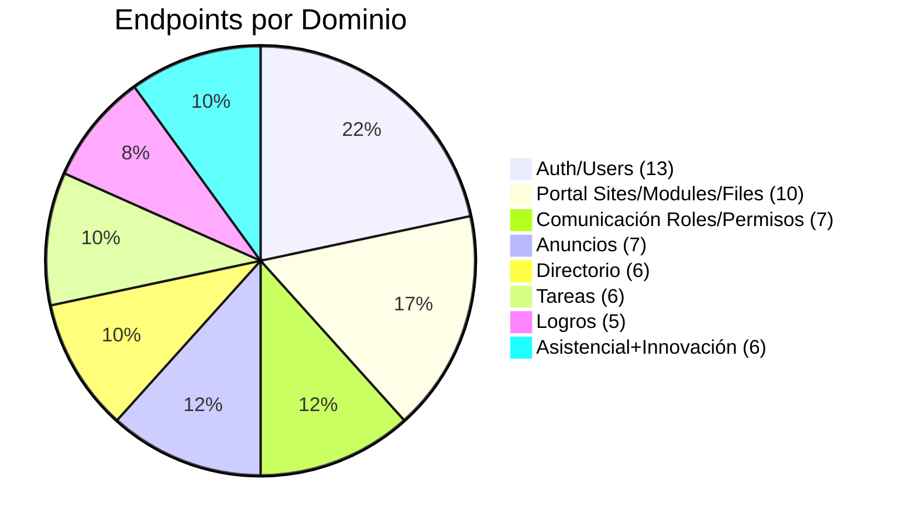

| Dominio | Método | Endpoint | Tabla | Estado |
|---|---|---|---|---|
| **Auth** | POST | `/api/auth/login` | `genusuario.genusuclahash` | ✅ JWT real |
| | POST | `/api/auth/logout` | - | ✅ |
| | GET | `/api/me` | `genusuario` | ✅ `authenticated()` |
| **Users** | GET/POST | `/api/users` | `genusuario` | ✅ |
| | PUT | `/api/users/{username}` | | ✅ |
| | PATCH | `/api/users/{username}/status` | | ✅ |
| | PATCH | `/api/users/{id}/password` | | ✅ |
| | GET | `/api/cargos` | `gencargointra` | ✅ |
| | GET | `/api/areas` | `genarea` | ✅ |
| | GET/POST | `/api/access-requests` | `gensolusuario` | ✅ POST público |
| | POST | `/api/access-requests/{id}/approve` | | ✅ ADMIN |
| | POST | `/api/access-requests/{id}/reject` | | ✅ ADMIN |
| | GET/POST | `/api/password-reset-requests` | `gensolusuario` | ✅ |
| | POST | `/api/password-reset-requests/{id}/complete` | | ✅ |
| | GET/POST | `/api/logs` | `genlogs` | ✅ |
| **Anuncios** | GET/POST | `/api/announcements` | `comanuncio` | ✅ |
| | PUT/DELETE | `/api/announcements/{id}` | borrado lógico `comanueliminado` | ✅ |
| | POST | `/api/announcements/{id}/publish` | `PENDIENTE→PUBLICADO` | ✅ |
| | POST | `/api/announcements/{id}/files` | `comanuncioarchivo` | ✅ |
| | GET | `/api/announcement-types` | `comtipoanuncio` | ✅ |
| **Tareas** | GET/POST | `/api/tasks` | `comtarsegui` | ✅ |
| | PUT | `/api/tasks/{id}` | | ✅ |
| | POST | `/api/tasks/{id}/complete` | `→ COMPLETADA` | ✅ |
| | POST/GET | `/api/tasks/{id}/comments` | `comtarcome` | ✅ |
| | POST | `/api/tasks/{id}/files` | `comtareaarchivo` | ✅ |
| **Logros** | GET/POST | `/api/achievements` | `comlogroacredi` | ✅ |
| | PUT/DELETE | `/api/achievements/{id}` | | ✅ |
| | POST | `/api/achievements/{id}/files` | `comlogroarchivo` | ✅ |
| **Directorio** | GET/POST/PUT/DELETE | `/api/directory/extensions` | `gendircextenciones` | ✅ `authenticated()` escritura |
| | GET/POST/PUT/DELETE | `/api/directory/emails` | `gendircorreo` | ✅ |
| | GET | `/api/directory/floors` | `genpiso` | ✅ público GET |
| | GET | `/api/directory/areas` | `genarea` | ✅ |
| **Roles** | GET/POST/PUT/DELETE | `/api/communication/roles` | `comrol`+`comrolpermiso` | ✅ ADMIN |
| | GET/POST/PUT/DELETE | `/api/communication/permissions` | `compermisos` | ✅ |
| | GET | `/api/communication/users` | `comusuario` | ✅ |
| | POST/PUT | `/api/communication/users/{id}/roles` | | ✅ |
| **Portal** | GET/POST | `/api/modules` | `genmodulo` | ✅ |
| | PATCH | `/api/modules/{id}/active` | | ✅ |
| | GET | `/api/sites?moduleId=` | `gensitredireccion` | ✅ público GET |
| | POST/PUT/DELETE | `/api/sites[/{id}]` | | ✅ `authenticated()` |
| | PATCH | `/api/sites/{id}/active` | ver limitación `BACKEND_IMPLEMENTACION.md:176` | ⚠️ no persiste |
| | POST | `/api/files` | `genarchivo` | ✅ |
| | GET | `/api/files/{id}` | streaming | ✅ público |
| | DELETE | `/api/files/{id}` | | ✅ ADMIN |
| **Asistencial** | GET/POST/PUT/DELETE | `/api/external-sites` | `asiconextern` | ✅ |
| | GET/POST/PUT/DELETE | `/api/contingency-formats` | `asiforcontin` | ✅ |
| | POST | `/api/contingency-formats/{id}/files` | `asiforconarchivo` | ✅ |
| **Innovación** | GET/POST/PUT/DELETE | `/api/innovation-links` | `innovanalitica` | ✅ |

> Fuente: `intranet-backend/docs/BACKEND_IMPLEMENTACION.md:45` + `SecurityConfig.java:42`

### 3.5 Frontend — Arquitectura y Estado

**Stack:** React 18 + Vite 6 + Tailwind 4 + Radix UI + `react-router 7.13` + Context API (sin Redux).

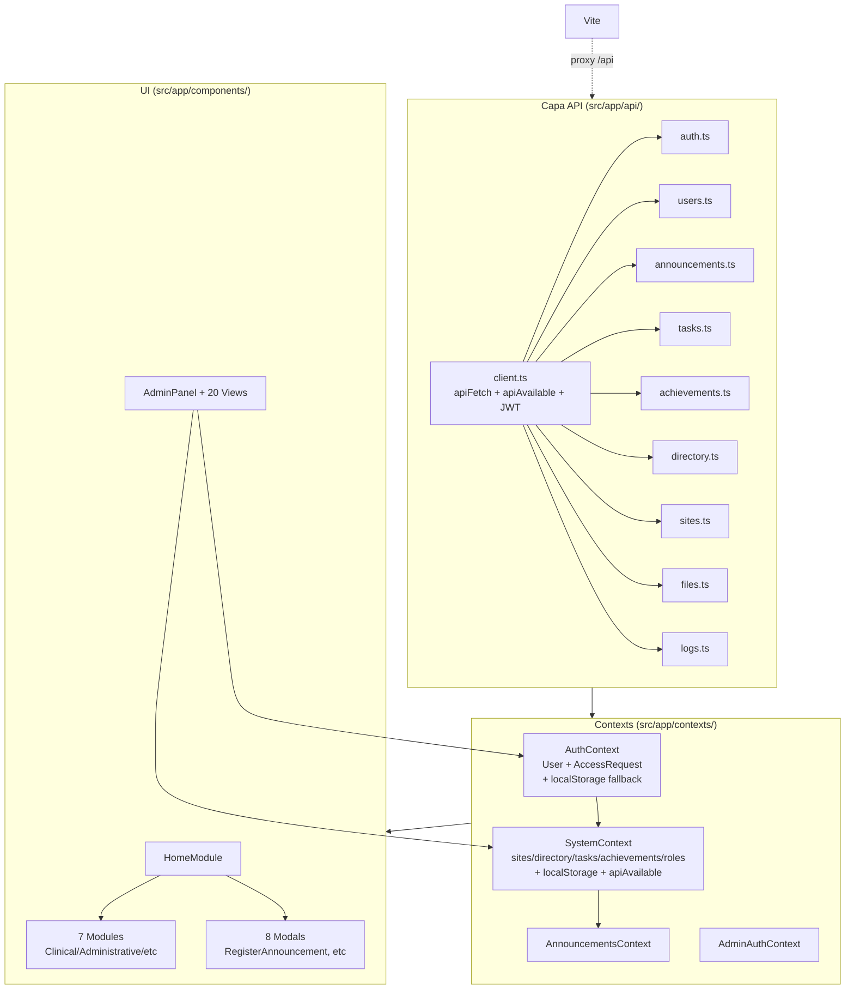

**Patrón Fallback Seguro** (`docs/FRONTEND_IMPLEMENTACION.md:36`):
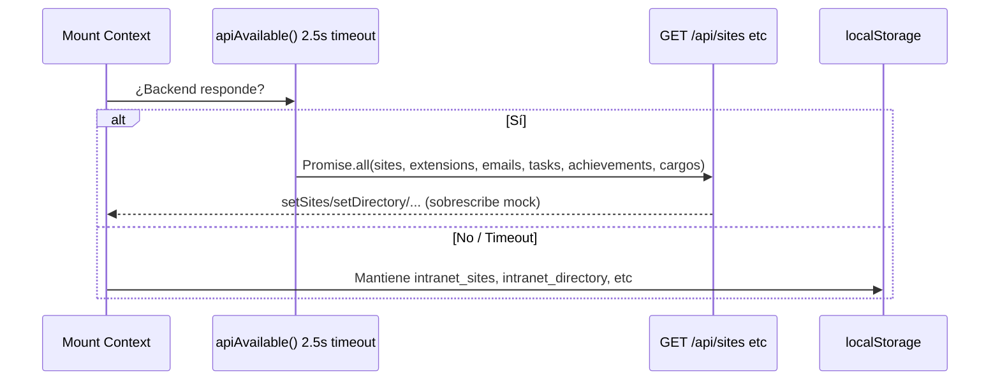

**Métricas Frontend:**
- `src/app/components/modules/*` 7 módulos + `admin/views/*` 20 vistas + `modals/*` 8 modales
- `src/styles/*` Tailwind + `src/app/utils/roles.ts` (D3 unificado) + `greetings.ts`
- Build: `vite build` → `dist/assets/index-*.js` (ver `Dockerfile` multi-stage con Nginx)

### 3.6 Seguridad

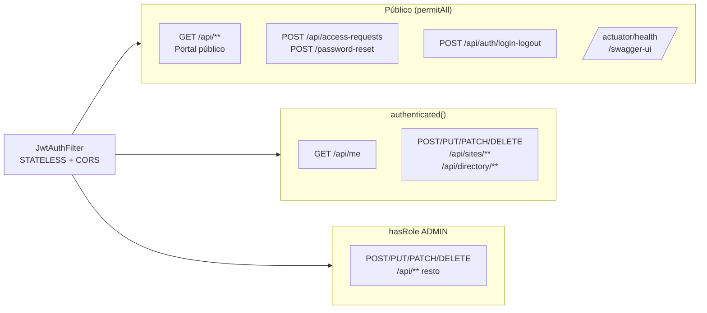

**Detalles** (`SecurityConfig.java:18`):
- `SessionCreationPolicy.STATELESS`, CSRF disabled, CORS habilitado (`CorsConfig` para `localhost:5173/3000`)
- `JwtService` con `JWT_SECRET`, expiración 480 min (`application-dev.yml:31`), `JwtAuthFilter` antes de `UsernamePasswordAuthenticationFilter`
- `PasswordConfig` BCrypt para `genusuario.genusuclahash`
- `AdminSeeder` siembra `administrador` + cargo `Comunicaciones` (`V7__seed_comunicaciones_cargo.sql`)
- **Limitaciones documentadas:** `PATCH /api/sites/{id}/active` no persiste (`gensitredireccion` sin columna estado) (`BACKEND_IMPLEMENTACION.md:176`); `gensolusuario` reutilizado para reset con marcador `RESET_PASSWORD`; `genequipodominio` sin endpoints.

### 3.7 DevOps y Despliegue

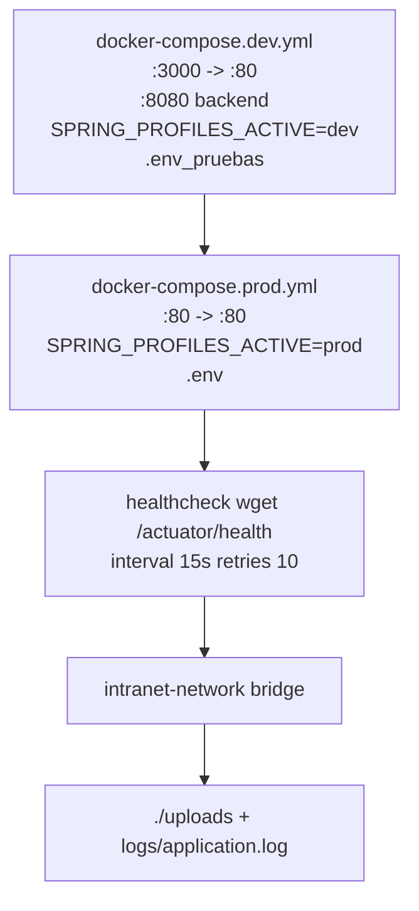

| Entorno | Archivo | Puerto | Profile | Env |
|---|---|---|---|---|
| **Dev** | `docker-compose.dev.yml:4` | 8080 + 3000 | `dev` | `.env_pruebas` |
| **Prod** | `docker-compose.prod.yml:4` | 8080 + 80 | `prod` | `.env` |
| **Frontend prod** | `Dockerfile` multi-stage | 80 | Nginx | `nginx.conf` SPA fallback |
| **Scripts** | `scripts/run-dev.ps1` / `run-prod.ps1` | - | - | - |

**Observabilidad:** `management.endpoints.web.exposure: health,info,metrics` + `health.show-details: always`. Logs en `logs/application.log` + `./uploads` (20MB max por archivo).

### 3.8 Calidad, Deuda Técnica y Roadmap

**Inventario de deuda** (`PLAN_IMPLEMENTACION.md:27` + `FRONTEND_IMPLEMENTACION.md:77`):

| Categoría | Detalle | Líneas / Archivos |
|---|---|---|
| **Código muerto** | 4 módulos (`CommunicationsModule`, `IntranetAdminModule`, `LogsModule`, `UserManagementModule`) + 13 modales + 4 vistas admin + `RecentAccessSection` + 2 logos | ~55 archivos / ~12.000 líneas |
| **Duplicación** | D1/D2 `AppCard+RedirectModal` en 9 archivos; D3 roles; D4 catálogo apps mock 2-3×; D5 dos modales contratos 1033 vs 558 líneas | Alto riesgo, bajo beneficio inmediato |
| **shadc/ui sin uso** | 44 componentes (`accordion`, `alert`, `badge`, `card`, etc.) | Solo viven `calendar`, `dialog`, `button`, `utils` |
| **Pendiente** | EPS/contratos/formatos aún solo `localStorage`; `genequipodominio` sin consumo; tests `mvnw test` solo unitarios (context test `@Disabled`) | Fases 6-7 |

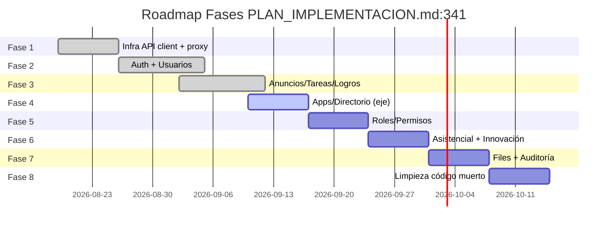

**Recomendación de orden** (`PLAN_IMPLEMENTACION.md:387`): Priorizar Auth+Anuncios+Apps/Directorio (alta), luego tareas/logros/roles (media), asistencial/innovación/files (baja), limpieza al final para no romper UI.

---

## 4. Capturas y Mockups de UI

> **Nota:** Este repo no incluye screenshots versionados. A continuación mockups Mermaid + referencias exactas al código para reproducir cada vista. Para capturas reales, ejecutar `npm run dev` en `Corporate-Intranet-Portal` y `.\mvnw spring-boot:run` en `intranet-backend`.

### 4.1 Home — Portal Público

**Archivo:** `Corporate-Intranet-Portal/src/app/components/modules/HomeModule.tsx:16`

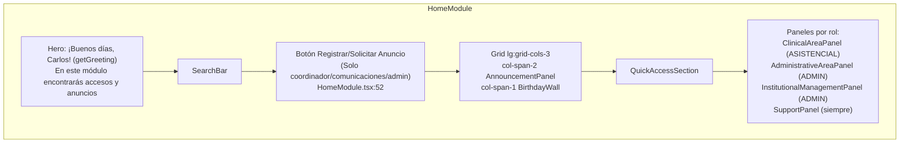

**Captura esperada:** Hero blanco con borde izquierdo `#0778AC`, título azul, subtítulo gris, barra de búsqueda, botón degradado rojo `#CF3438`, grid anuncios + cumpleaños, accesos rápidos, 4 paneles de apps.

### 4.2 Directorio

**Archivo:** `Corporate-Intranet-Portal/src/app/components/modules/DirectoryModule.tsx`

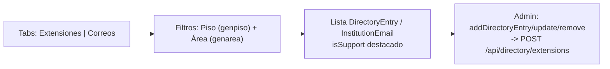

### 4.3 Panel Administrativo — 20 Vistas

**Archivo:** `Corporate-Intranet-Portal/src/app/components/admin/AdminPanel.tsx` + `views/*.tsx`

| Vista | Qué gestiona | API |
|---|---|---|
| `GeneralesUsuariosView` | Usuarios + cargos + solicitudes | `usersApi`, `apiFetch /cargos` |
| `GeneralesSitiosView` | `gensitredireccion` | `sitesApi` |
| `GeneralesModulosView` | `genmodulo` | `sitesApi` |
| `GeneralesDirectorioView` | Extensiones/correos | `directoryApi` |
| `CrearAnuncioView` + `AnunciosPendientesView` | `comanuncio` | `announcementsApi` |
| `TareasSeguimientoView` | `comtarsegui` | `tasksApi` |
| `LogrosAcreditacionesView` | `comlogroacredi` | `achievementsApi` |
| `PermisosComunicacionesView` + `UsuariosComunicacionesView` | `comrol`/`comusuario` | `communication/*` |
| `LogsView` | `genlogs` | `logsApi` |
| `ConsultaExternaView` / `FormatosContingenciaView` | `asiconextern` / `asiforcontin` | *(aún localStorage)* |

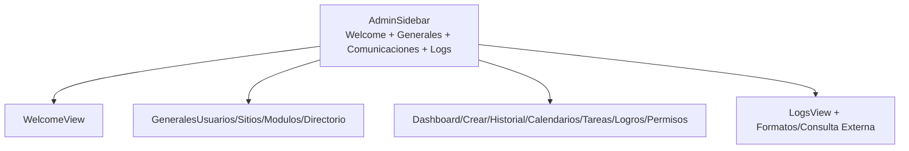

### 4.4 Diagrama de Componentes UI (reutilizables)

```
src/app/components/
├── Header.tsx (escudo Panel Admin) + Navigation.tsx + Footer.tsx
├── SearchBar.tsx + QuickAccessSection.tsx + AnnouncementPanel.tsx + BirthdayWall.tsx
├── AppCard.tsx (grid de aplicativos) + modals/RedirectModal.tsx
├── modules/* (7 módulos página completa)
├── admin/AdminPanel.tsx + AdminSidebar.tsx + rbac.ts + views/* (20)
├── modals/* (RegisterAnnouncementModal, ITSupportContactsModal, etc.)
└── ui/* (button, dialog, calendar, utils) — 44 sin uso eliminables
```

---

## 5. Conclusiones y Recomendaciones Priorizadas

### 5.1 Conclusión Técnica

Proyecto **arquitectónicamente sano**: DDD-lite por dominio, DTOs tipados, enums alineados a BD, Flyway con `baseline-on-migrate`, fallback offline bien diseñado. **4.541 LOC Java + 8.586 LOC TS** bien estructurados, 19 controllers y 28 entidades cubren el 80% del dominio. Falta **hardening** y **higiene**.

### 5.2 Conclusión No Técnica

Para la dirección: la intranet **ya entrega valor** (portal único, directorio vivo, anuncios trazables). Con 2-3 sprints adicionales (roles finos + archivos + limpieza) pasa de **"útil pero frágil" a "producto robusto y escalable"**.

### 5.3 Top 8 Recomendaciones (ordenado por ROI)

| # | Acción | Esfuerzo | Impacto | Archivo |
|---|---|---|---|---|
| 1 | **Proteger `sites/directory` escritura solo ADMIN** (hoy `authenticated()` permite cualquier logueado) | 1h | Alto (seguridad) | `SecurityConfig.java:55` |
| 2 | **Añadir columna `gensitredactivo` y persistir `PATCH /active`** | 2h | Alto (funcional) | `V9__add_sitio_activo.sql` + `SitioRedireccion.java` |
| 3 | **Migrar EPS/contratos/formatos a API** (quitar `localStorage` puro) | 1 sprint | Alto (datos) | `SystemContext.tsx:397` |
| 4 | **Tests: habilitar Testcontainers + `@SpringBootTest`** | ½ sprint | Alto (calidad) | `pom.xml` + `IntranetBackendApplicationTests` |
| 5 | **CI/CD GitHub Actions** (build + `flyway validate` + `npm run build`) | ½ sprint | Medio | `.github/workflows/` |
| 6 | **Limpieza Fase 8** (55 archivos/12k líneas + 44 shadcn) | 1 sprint | Medio (bundle -30%) | `PLAN_IMPLEMENTACION.md:378` |
| 7 | **Unificar D1/D2 con `useModulePage` + `ModuleAppGrid`** | 1 sprint | Medio (mantenibilidad) | `PLAN_IMPLEMENTACION.md:59` |
| 8 | **Documentar `.env` y rotar `JWT_SECRET`** (hoy en claro en `application-dev.yml`) | 1h | Alto (operación) | `.env.example` |

---

## 6. Glosario (No Técnico)

| Término | Qué significa (en simple) | Dónde lo ves |
|---|---|---|
| **Intranet** | Web interna solo accesible dentro de la empresa, como un "Facebook interno" pero de trabajo. | Todo el portal |
| **Módulo** | Cada sección del menú (Inicio, Asistencial, etc.). Es como una carpeta con apps. | `HomeModule.tsx:82` |
| **Sitio de Redirección** | Un botón/tarjeta que te lleva a otro sistema (DGH, GLPI...). Se configura sin programar. | `gensitredireccion` / `GeneralesSitiosView` |
| **Directorio** | Lista de extensiones y correos por piso y área. Como la guía telefónica del hospital. | `DirectoryModule.tsx` |
| **Anuncio / Comunicado** | Noticia interna con título, descripción y archivos. Puede estar PENDIENTE o PUBLICADO. | `AnnouncementPanel` |
| **Tarea de Seguimiento** | Encargo asignado a alguien, con prioridad ALTA/MEDIA/BAJA y comentarios. | `TareasSeguimientoView` |
| **Logro / Acreditación** | Reconocimiento institucional (ej. certificación). Se muestra con imagen y fecha. | `AccreditationAchievementsModal` |
| **Rol** | Conjunto de permisos (ej. "TI", "Comunicaciones"). Define qué puedes ver y hacer. | `AuthContext.tsx:6` |
| **Permiso** | Cada acción concreta (ej. "Crear usuarios", "Aprobar anuncios"). | `PermisosComunicacionesView` |
| **Panel Administrativo** | Zona restringida (escudo en header) solo para ADMIN/TI donde se configura todo. | `AdminPanel.tsx` |
| **Fallback offline** | Si el servidor no responde, la app sigue funcionando con datos guardados en el navegador. | `SystemContext.tsx:253` |
| **Backend / Frontend** | Backend = cerebro y BD (Java); Frontend = lo que ves y clickeas (React). | `pom.xml` / `package.json` |
| **API** | El "idioma" con el que frontend y backend se hablan (`/api/sites`, `/api/users`...). | `src/app/api/*.ts` |
| **BD / PostgreSQL** | Donde se guarda todo de forma permanente (28 tablas). | `DATABASE.md:1` |
| **Flyway / Migración** | Sistema que crea/actualiza las tablas de forma ordenada (V1, V6...). | `V1__baseline.sql:1` |
| **JWT** | Token (pulsera digital) que prueba que iniciaste sesión. Dura 480 min. | `JwtService.java` |
| **BCrypt** | Forma segura de guardar contraseñas (no se guardan en claro). | `PasswordConfig.java` |
| **Docker** | Caja que empaqueta todo para que funcione igual en cualquier servidor. | `docker-compose.prod.yml:1` |
| **Nginx** | Portero que entrega la web y redirige rápido. | `nginx.conf` |
| **Actuator / Health** | Página que dice si el sistema está vivo (`/actuator/health`). | `application-dev.yml:42` |
| **RBAC** | Control por roles: ves solo lo que tu rol permite. | `rbac.ts` |
| **localStorage** | Memoria del navegador donde se guardan datos temporales si no hay servidor. | `AuthContext.tsx:88` |
| **CORS / Proxy** | Permisos para que frontend (`:3000`) hable con backend (`:8080`) sin bloqueos. | `vite.config.ts:34` |

---

## 7. Anexos — Referencias y Métricas

### 7.1 Estructura de Archivos (resumida)

```
Intranet Institucional/
├── docs/
│   └── ANALISIS_PROYECTO.md          ← este archivo
├── intranet-backend/                 → Spring Boot 3.5 / Java 21
│   ├── pom.xml                       → 17 dependencias
│   ├── Dockerfile + docker-compose.yml
│   ├── docs/ {DATABASE, BACKEND_IMPLEMENTACION, PLAN_IMPLEMENTACION, DB_CHANGES}.md
│   └── src/main/
│       ├── java/co/com/icvc/intranet_backend/ (129 .java)
│       │   ├── user/ communication/ directory/ portal/ assistance/ innovation/
│       │   ├── security/ config/ common/
│       │   └── IntranetBackendApplication.java
│       └── resources/
│           ├── application{,-dev,-prod,-test}.yml
│           └── db/migration/ V1..V8 (8 archivos, 3 vacíos)
├── Corporate-Intranet-Portal/        → React 18 / Vite 6 / Tailwind 4
│   ├── package.json                  → 34 deps + 3 dev
│   ├── vite.config.ts                → proxy /api
│   ├── nginx.conf + Dockerfile
│   ├── docs/FRONTEND_IMPLEMENTACION.md
│   └── src/
│       ├── app/api/ (9 módulos) + contexts/ (4) + components/ (76 .tsx)
│       └── styles/ + assets/
├── docker-compose.dev.yml / prod.yml
└── scripts/run-{dev,prod}.{sh,ps1}
```

### 7.2 Referencias Cruzadas

| Tema | Archivo : Línea |
|---|---|
| Stack Backend | `intranet-backend/pom.xml:5` |
| Stack Frontend | `Corporate-Intranet-Portal/package.json:1` |
| BD 29 tablas | `intranet-backend/docs/DATABASE.md:14` |
| V1 baseline DDL | `intranet-backend/src/main/resources/db/migration/V1__baseline.sql:19` |
| Arquitectura backend | `intranet-backend/docs/BACKEND_IMPLEMENTACION.md:22` |
| Plan 8 fases | `intranet-backend/docs/PLAN_IMPLEMENTACION.md:341` |
| Frontend fallback | `Corporate-Intranet-Portal/docs/FRONTEND_IMPLEMENTACION.md:36` |
| AuthContext RBAC | `Corporate-Intranet-Portal/src/app/contexts/AuthContext.tsx:6` |
| SystemContext sync | `Corporate-Intranet-Portal/src/app/contexts/SystemContext.tsx:253` |
| HomeModule roles | `Corporate-Intranet-Portal/src/app/components/modules/HomeModule.tsx:21` |
| SecurityConfig RBAC | `intranet-backend/src/main/java/co/com/icvc/intranet_backend/security/SecurityConfig.java:40` |
| Vite proxy | `Corporate-Intranet-Portal/vite.config.ts:34` |
| Compose dev/prod | `docker-compose.dev.yml:1` / `docker-compose.prod.yml:1` |

### 7.3 Cómo Verificar Este Análisis (comandos)

```bash
# Métricas
Get-ChildItem intranet-backend/src -Filter *.java -Recurse | Measure-Object
Get-ChildItem Corporate-Intranet-Portal/src -Include *.ts,*.tsx -Recurse | Get-Content | Measure-Object -Line
Get-Content intranet-backend/src/main/resources/db/migration/V1__baseline.sql | Select-String "CREATE TABLE"

# Build
.\mvnw clean package -DskipTests        # backend
npm run build --prefix Corporate-Intranet-Portal  # frontend

# Run
docker compose -f docker-compose.dev.yml up --build
# Frontend: http://localhost:3000  Backend: http://localhost:8080/actuator/health
```

### 7.4 Historial Git

```
fe554f0 se esta implementando la persistencia de datos de los modulos de redireccion, ext y correos
347f741 se cargan .env de frontend
df7f494 se agregan archivos ignorados en el .gitignore
d781c66 terminar de configurar el modulo de generales-usuarios, se aplico integracion backend-frontend
dc40ad4 implementacion del backend, replicar BD en homeserver
8646085 Primer cargue de interfaz y backend
```

---

*Documento generado el 2026-09-10 a partir de inspección directa del repositorio. Para dudas o feedback: https://github.com/anomalyco/opencode — Modelo: muse-spark-1.2-contributor-free.*
